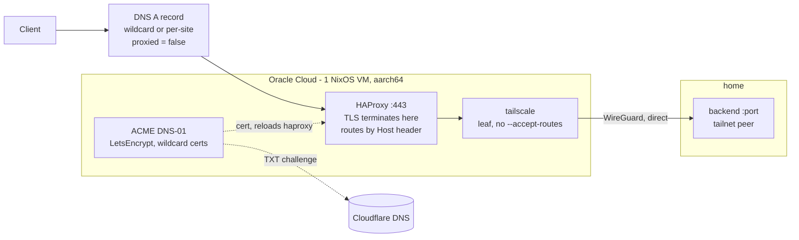

# 00-cloud-edge

HAProxy on a free Oracle Cloud ARM box: terminates TLS on a public IP, forwards
to home over Tailscale. Nothing at home is port-forwarded, and no traffic
crosses Cloudflare.



Separate from the cluster in every way that matters: its own flake, its own
Terraform root, its own mise config. The cluster is x86_64 and every node in it
is a k3s node from one golden image

## edge.json

Shape, zone, wildcards and sites, read by both `flake.nix`
(`builtins.fromJSON`) and `terraform/` (`jsondecode`) — the same idiom as
`hosts.json` at the repo root. **Gitignored**: the public hostnames are the one
part of this setup worth not publishing. `edge.json.example` has the structure;
without the real file the flake eval and every `tf:*` task fail.

Two lists. `wildcards` are base domains — each gets a `*.<base>` cert and a
`*.<base>` A record. `sites` are `domain` → `backend` pairs, each becoming an
HAProxy backend routed by `Host` header, where `backend` is `host:port` as seen
from the edge, so a tailnet address.

A site under a listed wildcard needs no DNS record and no cert of its own, so
adding one is a `sites` entry and a redeploy — no Terraform, no new LetsEncrypt
order. A site outside every wildcard still gets both, so the two styles mix
freely.

A wildcard covers exactly one label: `*.relay.example.com` serves
`app.relay.example.com` but not `a.b.relay.example.com`, and not the bare
`relay.example.com`. Both of those fall back to their own cert and record.

## How it is built

Three phases, and only the middle one is destructive. Terraform creates an
Ubuntu ARM instance, a public IP and the DNS records; `install` uses
nixos-anywhere to kexec into an installer, partition with disko and lay down
NixOS, erasing the box; `deploy` pushes the flake and switches, and is
repeatable from then on.

Both build **on the box**, not locally — the build host is x86_64 and the
instance is aarch64.

The public IP is ephemeral on purpose. A reserved OCI address cannot be attached
at create time, which would mean no internet during first boot and no unattended
install; taking the ephemeral one and pointing the A records at it removes that
ordering problem. It is also why the Cloudflare provider lives in *this*
Terraform root and not `terraform/cloudflare/` — the value only exists here.

## Layout

```text
edge.json                 shape, zone, wildcards, sites — read by the flake and by terraform
flake.nix                 nixosConfigurations.cloud-edge (aarch64)
nixos/hosts/oracle-edge/  default, hardware, disk-config, ssh-keys, secrets, tailscale, acme, haproxy, logging
                          secrets.sops.yaml — the box's own secrets, committed encrypted
terraform/                providers, backend, network, compute, dns, outputs
scripts/                  install.sh, deploy.sh, push-age-key.sh, tf-env.sh
```

TLS terminates here rather than passing SNI through, because there is no reverse
proxy at home to hand the connection to. Certs are LetsEncrypt over **DNS-01**,
which is why port 80 is closed in both the OCI security list and the NixOS
firewall.

Tailscale here is a leaf with no `--accept-routes`: the backend is its own
tailnet device, and accepting the cluster's subnet would give the one machine
with a public IP a path to the whole LAN. `--ssh` is on as break-glass, so a
dead sshd does not mean a trip to the OCI serial console.

`logging.nix` ships the journal — HAProxy, tailscaled, ACME, sshd and the kernel
are all one journald stream — to the cluster's Loki over the tailnet.

## Credentials

All in `secrets/` at the repo root. Start from `terraform/oci.env.example`.

| File                   | What it is                                                     |
| ---------------------- | -------------------------------------------------------------- |
| `oci.env`              | OCIDs, fingerprint, region, compartment, SSH public key        |
| `oci_api_key.pem`      | OCI API signing key (`_public.pem` is already uploaded to OCI) |
| `cloudflare-api-token` | Terraform's copy, shared with `terraform/cloudflare/`          |
| `age.key`              | Opens every `*.sops.yaml` in the repo, this box's included     |

Terraform reads the first three. **The box itself reads only `age.key`**: its
pre-auth key and its own copy of the Cloudflare token live encrypted in
`nixos/hosts/oracle-edge/secrets.sops.yaml`, which is committed, and sops-nix
decrypts them at activation. Edit them with `mise run secrets:edit` — from this
directory, never from `apps/`, which has a different `.sops.yaml`.
