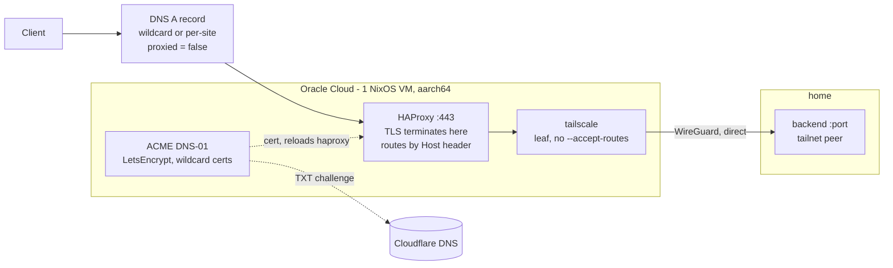

# 00-cloud-edge

HAProxy on a free Oracle Cloud ARM box: terminates TLS on a public IP, forwards
to home over Tailscale. Nothing at home is port-forwarded, and no traffic
crosses Cloudflare.



Hostnames, wildcards and backends live in `edge.json`, **gitignored** — copy
`edge.json.example`. Nothing works without it; the flake eval and every `tf:*`
task read it.

## Use

```bash
mise trust              # once, in this directory
mise run tf:plan
mise run tf:apply       # Ubuntu ARM instance, public IP, DNS records
mise run install        # nixos-anywhere — one shot, erases the box
mise run deploy         # push the flake and switch; repeatable from here
mise run status
```

Also `mise run ssh`, `mise run ip`, `mise run check` (fmt + validate + flake
eval).

## Sites and wildcards

`edge.json` has two lists. `wildcards` are base domains — each gets a
`*.<base>` cert and a `*.<base>` A record. `sites` are `domain` → `backend`
pairs, each becoming an HAProxy backend routed by `Host` header.

A site under a listed wildcard needs no DNS record and no cert of its own, so
adding one is a `sites` entry and `mise run deploy` — no `tf:apply`, no new
LetsEncrypt order. A site outside every wildcard still gets both, so the two
styles mix freely.

A wildcard covers exactly one label: `*.relay.example.com` serves
`app.relay.example.com` but not `a.b.relay.example.com`, and not the bare
`relay.example.com`. Both of those fall back to their own cert and record.

## Layout

```
edge.json            shape, zone, wildcards, sites — read by the flake and by terraform
flake.nix            nixosConfigurations.edge-1 (aarch64)
nixos/hosts/edge-1/  default, hardware, disk-config, ssh-keys, tailscale, acme, haproxy
terraform/           providers, backend, network, compute, dns, outputs
scripts/             install.sh, deploy.sh, push-secrets.sh, tf-env.sh
```

## Credentials

All in `secrets/` at the repo root. Start from `terraform/oci.env.example`.

| File                     | What it is                                                      |
| ------------------------ | --------------------------------------------------------------- |
| `oci.env`                | OCIDs, fingerprint, region, compartment, SSH public key          |
| `oci_api_key.pem`        | OCI API signing key (`_public.pem` is already uploaded to OCI)   |
| `cloudflare-api-token`   | Shared with `terraform/cloudflare/`; also on the box for DNS-01  |
| `tailscale-authkey-edge` | Tagged pre-auth key; falls back to `tailscale-authkey`           |

Design notes, failure modes and the reasoning behind all of it are in
`CLAUDE.md` under **00-cloud-edge/**.
