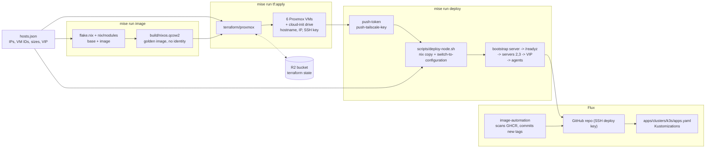
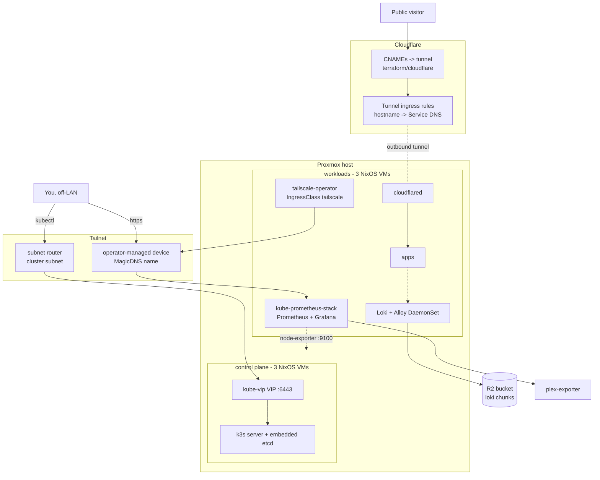

# infrastructure

Home lab: an HA k3s cluster of **3 servers** (control plane, embedded etcd) and
**3 agents**, running as NixOS VMs on Proxmox. Terraform creates the VMs, NixOS
owns everything inside them, kube-vip floats a control-plane VIP across the
servers, and Flux deploys the workloads in `apps/`.

```
hosts.json            single source of truth: IPs, VM IDs, sizes, VIP
flake.nix             golden image + one nixosConfiguration per node
nix/modules/          base, hardware, network, tailscale, k3s-server, k3s-agent, image
terraform/proxmox/    uploads the image, creates the six VMs
terraform/cloudflare/ the tunnel, its ingress rules, and the DNS records
apps/                 GitOps — what Flux deploys (see apps/README.md)
mise.toml             the task runner
```

## How it works

One generic NixOS image is built once and cloned into six VMs, each getting its
hostname, IP and SSH key from a cloud-init drive. `mise run deploy` then replaces
that generic system with the real per-node config, in order: bootstrap server →
remaining servers → agents. Agents join the VIP, so any one control-plane node
can die.

### Build and deploy

Everything below reads `hosts.json`. Terraform makes the VMs exist; NixOS makes
them into cluster nodes; Flux fills the cluster with workloads.



### Runtime

Two independent tailscale mechanisms: the nodes are a **subnet router** for the
cluster subnet; the operator gives individual Services their **own** tailnet
device. Public traffic never touches either — it arrives through an outbound
cloudflared tunnel, so no port is open to the internet.



## Setup

Needs Nix **or** Docker (`scripts/nix.sh` falls back to the `nixos/nix`
container), a Proxmox API token with **privilege separation off**
(`pveum user token add root@pam terraform --privsep 0`), SSH access to the
Proxmox node, and `mise trust` in this directory.

The flake is evaluated from the git tree, so **`git add` before deploying** —
untracked changes are invisible to Nix and `scripts/nix.sh` will refuse to run.

Edit `hosts.json` first — the subnet, the VIP, and one entry per node — then:

```bash
cp terraform/proxmox/terraform.tfvars.example terraform/proxmox/terraform.tfvars
$EDITOR terraform/proxmox/terraform.tfvars   # endpoint, token, node, datastores

mise run preflight        # checks the API, datastores, VM IDs, IPs, SSH first
mise run bootstrap        # image -> tf apply -> deploy -> kubeconfig -> status
```

## Tasks

```bash
mise run image            # build the golden qcow2 into build/
mise run tf:plan          # and tf:apply, tf:destroy
mise run deploy           # every node, in order
mise run deploy-node k3s-agent-2
mise run kubeconfig       # ./kubeconfig, pointed at the VIP
mise run status           # nodes + kube-system pods
mise run ts:status        # tailnet address and routes per node
mise run cf:plan          # and cf:apply — the Cloudflare tunnel and DNS
mise run reset            # DESTRUCTIVE: wipe k3s state cluster-wide
```

Secrets live in `secrets/` (gitignored): `k3s-token` and `tailscale-authkey` are
pushed to the nodes rather than baked into the image, `age.key` is what Flux
decrypts `apps/` with, `cloudflare-api-token` is the Terraform provider's, and
`r2.tfbackend` holds the R2 credentials for the state backend.

Terraform state for both roots lives in an R2 bucket. Credentials and the R2
endpoint are **not** in the backend block — copy `terraform/r2.tfbackend.example`
to `secrets/r2.tfbackend` and fill it in; `tf:init` and `cf:init` pass it with
`-backend-config`.

If the image upload times out over a slow link — `iso` content always goes
through the PVE HTTP API, with no resume — use
`mise run push-image root@pve-host` and set `upload_image = false` in
`terraform/proxmox/terraform.tfvars`.

## Remote access

Every node joins a tailnet and the three servers advertise the cluster subnet
into it, so remote `kubectl` still talks to the VIP and stays HA. Drop a reusable
pre-auth key in `secrets/tailscale-authkey`, `mise run deploy`, then approve the
subnet route once in the Tailscale admin console. Clients need
`tailscale up --accept-routes`; `./kubeconfig` needs no changes between LAN and
tailnet.

Set `cluster.tailscale.enable` to `false` in `hosts.json` to drop it entirely.

## Cloudflare

Nothing is exposed by an ingress controller — traffic arrives through the
cloudflared tunnel running in the cluster, which dials out and forwards to
Services by cluster DNS. The tunnel, its hostname → Service rules and the CNAMEs
pointing at it live in `terraform/cloudflare/`:

```bash
cp terraform/cloudflare/terraform.tfvars.example terraform/cloudflare/terraform.tfvars
$EDITOR terraform/cloudflare/terraform.tfvars   # account, zones, ingress
mise run cf:plan
mise run cf:apply
```

Adding a public hostname is one `ingress` entry — the CNAME is derived from it.
That list is authoritative: a rule added in the dashboard is reverted on the next
apply.

The API token goes in `secrets/cloudflare-api-token` and needs three permissions
on a custom token: **Account / Cloudflare Tunnel / Edit**, **Zone / DNS / Edit**,
and **Zone / Zone / Read** (DNS/Edit does not imply it, and without it zone
lookups quietly return nothing).

## Notes

- Traefik and servicelb are disabled; kube-vip does the control plane only.
- Rebuilding the image does not recreate live VMs — node changes ship via
  `deploy`, not Terraform. Changing a node's cores/memory/disk in `hosts.json` is
  a `tf:apply`; changing its IP is both.
- Firewall is on: 6443/2379/2380/10250 + UDP 8472 on servers, 10250 + 8472 on
  agents, UDP 41641 and a trusted `tailscale0` everywhere.
- Terraform state holds credentials in cleartext (the tunnel token, the Proxmox
  token). It lives in R2, so keep that bucket private.
