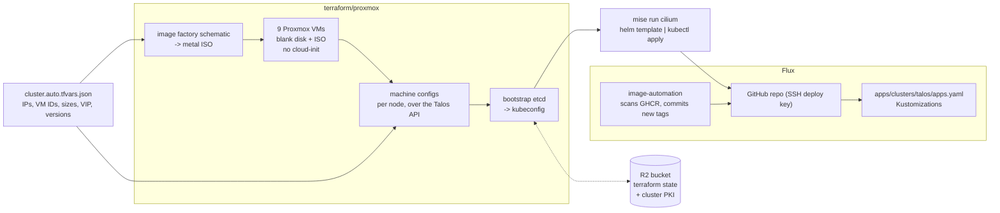
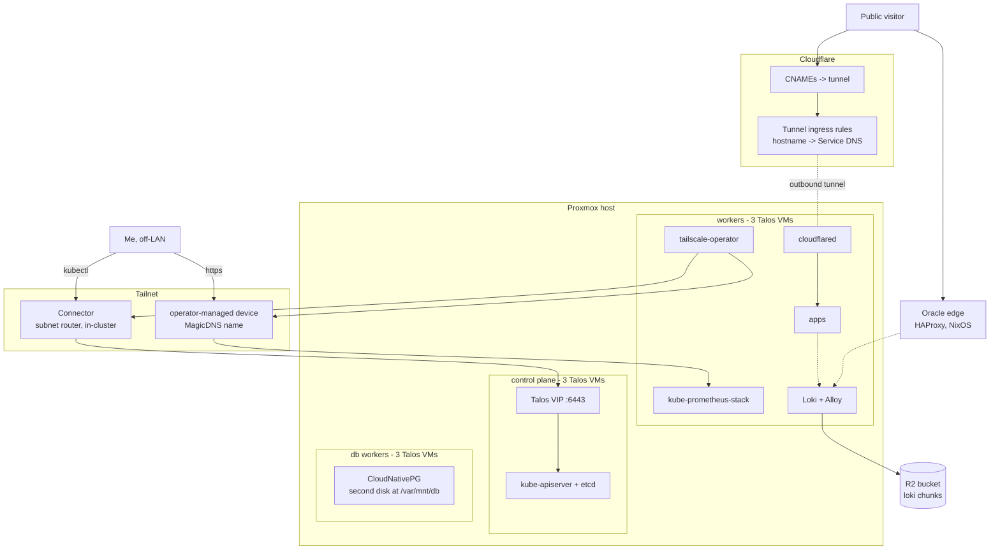

# infrastructure

My homelab, in full. Nine VMs on a single Proxmox box become a highly-available
Kubernetes cluster — 3 control plane nodes with embedded etcd, 3 workers, 3
tainted database workers — and everything that runs on it is in this repo.

It is public because there is nothing to hide in it: every secret is either
encrypted in place or lives outside the tree entirely. It is not a template, and
you should not try to `terraform apply` it — the addresses, VM IDs and zone IDs
are mine. It is here as a worked example of one way to do this, and because I am
quite fond of it.

The whole thing rebuilds from `terraform apply` and a git push. There is no
golden image, no configuration-management step, and nothing I have SSH'd into to
fix by hand.

## How it fits together

**One file is the source of truth.** `terraform/proxmox/cluster.auto.tfvars.json`
holds every address, VM ID, disk size, the VIP and the Talos and Kubernetes
versions. Terraform reads it as typed, validated variables; `jq` reads the same
file in shell scripts. There is no second copy.

**Terraform builds the cluster, not just the VMs.** Talos Linux takes its entire
configuration through its own API, so there is no cloud-init and no Ansible
afterwards. One `apply` resolves an image-factory ISO, creates the VMs, pushes a
machine config to each node and bootstraps etcd.



**Flux owns everything above the CNI.** Cilium is installed outside Flux on
purpose — nothing that reconciles from inside the cluster can install the reason
the cluster has a pod network. After that, `apps/` is the whole story, and image
tags are rewritten into git by image-automation rather than by me.

## Getting traffic in and out

No port is open to the internet. Public traffic arrives through an **outbound**
cloudflared tunnel, so the firewall has nothing to forward.

Nothing on the tailnet is a node, either — Talos has no systemd to run
`tailscaled` in. Instead the Tailscale operator runs *in* the cluster: a
`Connector` re-advertises the cluster subnet so `kubectl` works from anywhere,
and individual Services get their own tailnet device with a MagicDNS name.



There is one machine outside the cluster: a free Oracle ARM box running NixOS and
HAProxy, in `00-cloud-edge/`.

## Layout

```text
terraform/proxmox/     the nine VMs, the machine configs, the bootstrap
terraform/cloudflare/  the tunnel, its ingress rules, the DNS records
terraform/oracle/      Object Storage — where Postgres backups land
tailscale/             the tailnet policy file, as code
talos/                 Cilium's values, installed outside Flux on purpose
apps/                  everything Flux deploys
00-cloud-edge/         the public Oracle edge, NixOS
```

Every command is a `mise` task. State for all five Terraform roots lives in a
Cloudflare R2 bucket. Secrets in `apps/` are SOPS-encrypted to a single age key that also
decrypts the edge; nothing else in the tree is sensitive.

Design notes, failure modes and the things I learned by breaking them are in
[CLAUDE.md](CLAUDE.md).
