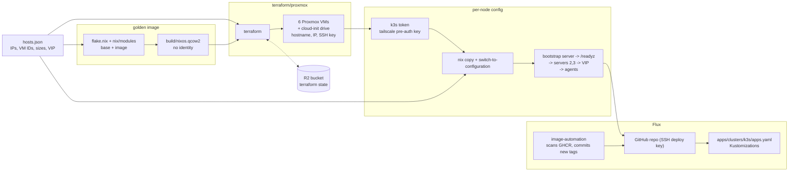
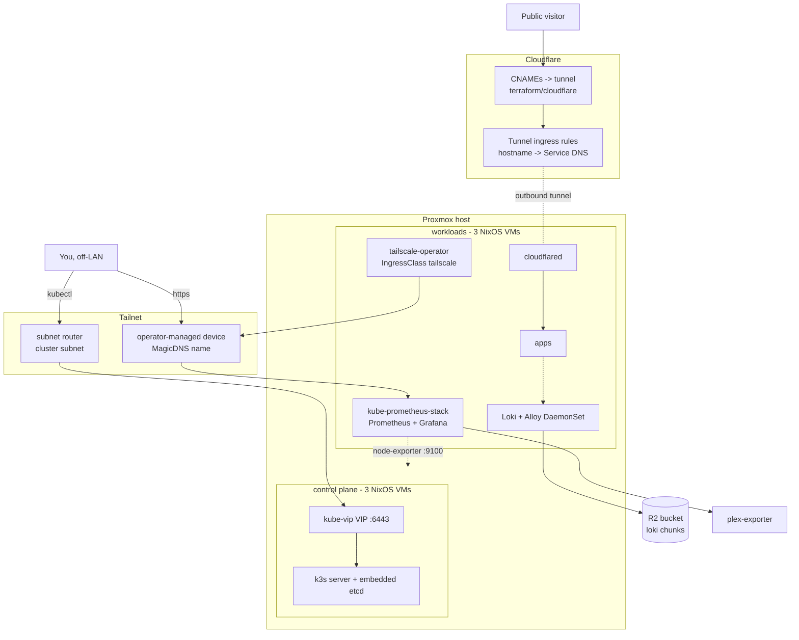

# infrastructure

Homelab Infra: an HA k3s cluster of **3 servers** (control plane, embedded etcd) and
**3 agents**, running as NixOS VMs on Proxmox. Terraform creates the VMs, NixOS
owns everything inside them, kube-vip floats a control-plane VIP across the
servers, and Flux deploys the workloads in `apps/`.

```
hosts.json            single source of truth: IPs, VM IDs, sizes, VIP
flake.nix             golden image + one nixosConfiguration per node
nix/modules/          base, hardware, network, tailscale, k3s-server, k3s-agent, image
terraform/proxmox/    uploads the image, creates the six VMs
terraform/cloudflare/ the tunnel, its ingress rules, and the DNS records
tailscale/            the tailnet policy file, applied by its own Terraform root
apps/                 GitOps — what Flux deploys (see apps/README.md)
00-cloud-edge/        the public Oracle edge (see 00-cloud-edge/README.md)
mise.toml             the task runner
```

## How a node comes to exist

One generic NixOS image is built once and cloned into six VMs, each getting its
hostname, IP and SSH key from a cloud-init drive. Deploying then replaces that
generic system with the real per-node config, in order: bootstrap server →
remaining servers → agents. Agents join the VIP, so any one control-plane node
can die.

The image carries no identity, which is the point — it is the same bytes for
every node, and everything that distinguishes them arrives afterwards. That is
also why `nix/modules/hardware.nix` exists: it re-states the root filesystem and
boot settings that the image generator supplies to the image but not to a node
config.



`hosts.json` is read by both `flake.nix` (`builtins.fromJSON`) and
`terraform/proxmox/main.tf` (`jsondecode`), so the two never disagree about what
a node is. Which of them acts on a change depends on the field: cores, memory
and disk are Terraform's; an IP is both Terraform's and NixOS's.

## Runtime

Two independent tailscale mechanisms: the nodes are a **subnet router** for the
cluster subnet; the operator gives individual Services their **own** tailnet
device. Public traffic never touches either — it arrives through an outbound
cloudflared tunnel, so no port is open to the internet.



## State and secrets

Terraform state for every root lives in a Cloudflare R2 bucket. The backend
blocks are deliberately partial — credentials and the endpoint are absent,
because a backend block takes no variables and this repo is public, and the
endpoint alone carries the account ID. They are supplied at `init` time from
`secrets/r2.tfbackend`.

`secrets/` is gitignored and holds what the cluster cannot be given declaratively:

| file | what it is |
| --- | --- |
| `k3s-token` | the join token, pushed to nodes rather than baked into the image |
| `tailscale-authkey` | tagged pre-auth key; tagged so the route auto-approves and the key never expires |
| `age.key` | what Flux decrypts `apps/` with |
| `cloudflare-api-token` | the Terraform provider's, and the edge's DNS-01 credential |
| `r2.tfbackend` | R2 credentials for the state backend |

The k3s token and the tailscale key are pushed to `/var/lib/` on each node
before its first switch, because k3s will not start without the former and
tailscale's autoconnect runs during activation.

## Working on it

Every command is a `mise` task; `mise.toml` is the list, and each directory's
`CLAUDE.md` explains what the tasks do and what breaks. Three separate configs:
the root (cluster), `apps/` (GitOps) and `00-cloud-edge/` (the edge), each
needing `mise trust` once.

The design notes — why a setting is load-bearing, what breaks if it changes, and
the failure modes found the hard way — live in `CLAUDE.md` beside the thing they
describe:

| directory | what it documents |
| --- | --- |
| `terraform/proxmox/` | the six VMs, and the Proxmox provider's sharp edges |
| `terraform/cloudflare/` | the cloudflared tunnel, its ingress rules and DNS |
| `tailscale/` | the tailnet policy file and the Terraform root that applies it |
| `apps/` | Flux GitOps, SOPS, image automation |
| `apps/base/monitoring/` | Prometheus + Grafana |
| `apps/base/tailscale-operator/` | the `tailscale` IngressClass and proxy tags |
| `apps/base/loki/` | Loki + Alloy, R2 chunk storage, the edge's push path |
| `00-cloud-edge/` | the public Oracle edge: HAProxy, ACME, its own flake |

There is no test suite. "Does it work" is `mise run preflight`, a `terraform
plan`, a `nix eval` of the affected node, and `mise run status`.
