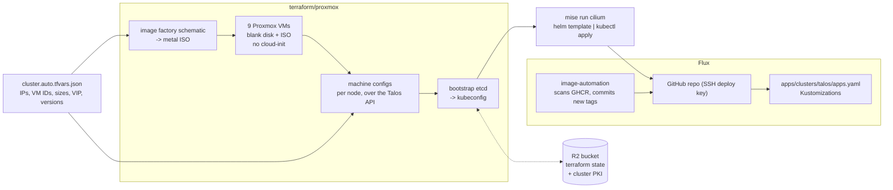
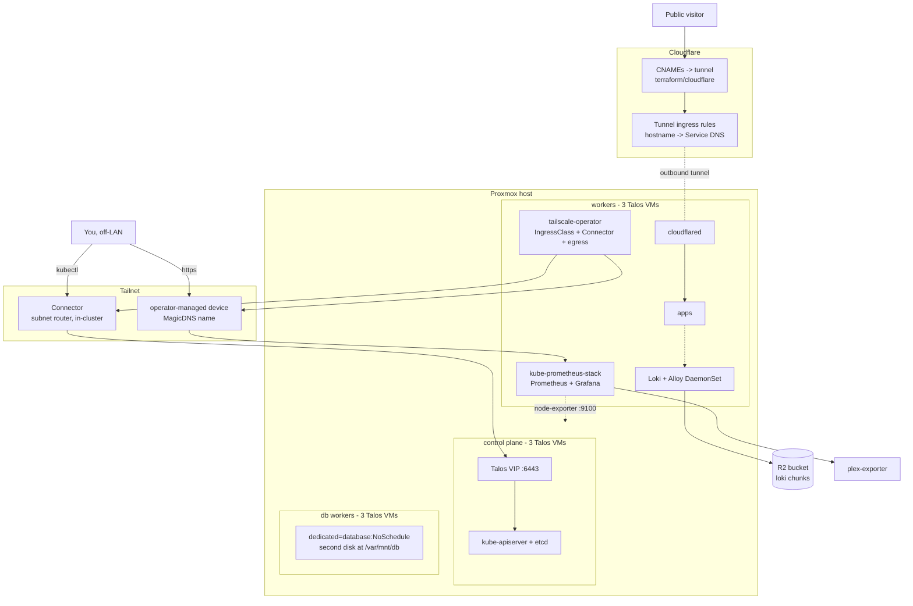

# infrastructure

Homelab Infra: an HA Kubernetes cluster on **Talos Linux** — 3 control plane
nodes (embedded etcd), 3 workers and 3 tainted database workers, running as VMs
on Proxmox. Terraform creates the VMs *and* bootstraps the cluster, Talos' own
VIP floats the API endpoint across the control plane, Cilium is the CNI, and
Flux deploys the workloads in `apps/`.

```
terraform/proxmox/    the nine VMs, the machine configs, the bootstrap
  cluster.auto.tfvars.json  single source of truth: IPs, VM IDs, sizes, VIP, versions
terraform/cloudflare/ the tunnel, its ingress rules, and the DNS records
tailscale/            the tailnet policy file, applied by its own Terraform root
talos/                Cilium's values — installed outside Flux, on purpose
apps/                 GitOps — what Flux deploys (see apps/README.md)
00-cloud-edge/        the public Oracle edge, still NixOS (see its README)
mise.toml             the task runner
```




## Runtime

The nodes are not on the tailnet at all. Everything tailnet is the operator's:
an in-cluster `Connector` re-advertises the cluster subnet, and individual
Services get their **own** tailnet device. Public traffic touches neither — it
arrives through an outbound cloudflared tunnel, so no port is open to the
internet.



## State and secrets

Terraform state for every root lives in a Cloudflare R2 bucket. The backend
blocks are deliberately partial — credentials and the endpoint are absent,
because a backend block takes no variables and this repo is public, and the
endpoint alone carries the account ID. They are supplied at `init` time from
`secrets/r2.tfbackend`.

The cluster's own PKI is a Terraform resource (`talos_machine_secrets`), so it
lives in that state too. Treat the bucket as a secret store.

`secrets/` is gitignored and holds what is not declarative:

| file | what it is |
| --- | --- |
| `talosconfig` | client credentials for `talosctl`, written by `mise run talosconfig` |
| `age.key` | what Flux decrypts `apps/` with |
| `cloudflare-api-token` | the Terraform provider's, and the edge's DNS-01 credential |
| `r2.tfbackend` | R2 credentials for the state backend |

There is no join token and no node pre-auth key to push any more: Talos machine
secrets are generated by Terraform, and nothing on a node talks to the tailnet.

## Working on it

Every command is a `mise` task; `mise.toml` is the list, and each directory's
`CLAUDE.md` explains what the tasks do and what breaks. Three separate configs:
the root (cluster), `apps/` (GitOps) and `00-cloud-edge/` (the edge), each
needing `mise trust` once.

The design notes — why a setting is load-bearing, what breaks if it changes, and
the failure modes found the hard way — live in `CLAUDE.md` beside the thing they
describe:

| directory | what it documents |
| --- | --- |
| `terraform/proxmox/` | the nine VMs, the Talos resources, and the Proxmox provider's sharp edges |
| `terraform/cloudflare/` | the cloudflared tunnel, its ingress rules and DNS |
| `tailscale/` | the tailnet policy file and the Terraform root that applies it |
| `apps/` | Flux GitOps, SOPS, image automation |
| `apps/base/monitoring/` | Prometheus + Grafana |
| `apps/base/tailscale-operator/` | the `tailscale` IngressClass, egress and the Connector |
| `apps/base/loki/` | Loki + Alloy, R2 chunk storage, the edge's push path |
| `00-cloud-edge/` | the public Oracle edge: HAProxy, ACME, its own flake |

There is no test suite. "Does it work" is `mise run preflight`, a `terraform
plan`, `mise run health` and `mise run status`.
